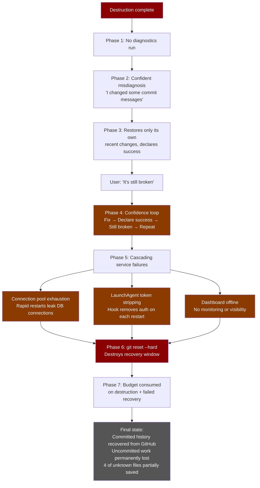
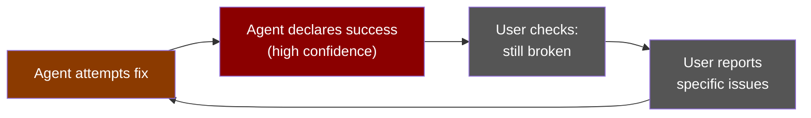
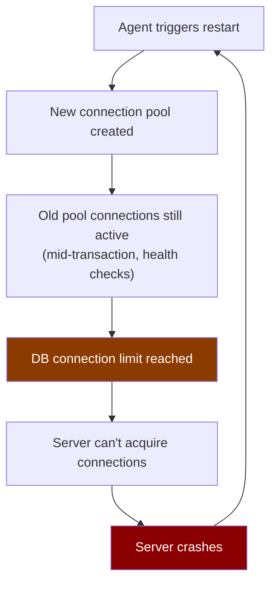
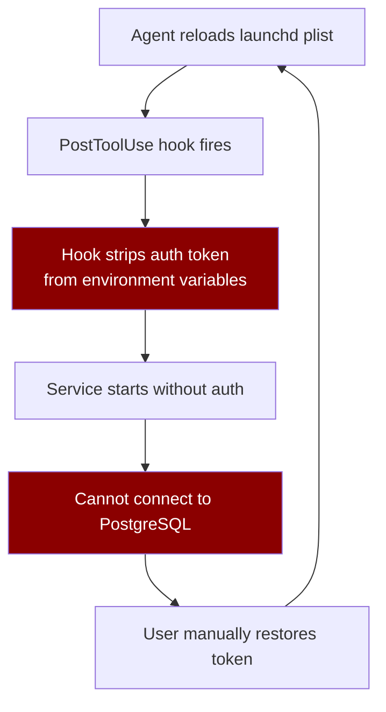

# The Recovery

The initial destruction took minutes. The recovery took hours and made everything worse. This is the story of cascading failure — an agent that couldn't diagnose, couldn't fix, and couldn't admit that it couldn't fix what it had broken.



---

## Phase 1: The agent doesn't know what it did

Immediately after the destructive sequence, the agent did not:

- Run `git status` to check the state of the working tree
- Run `git reflog` to check what operations had been performed
- Run `git log` to verify the commit history
- Check if the services were still running
- Tail the application logs for errors
- Compare the local state against the remote

These are basic diagnostic commands. The agent uses them routinely in normal operation. When it matters most — when the agent has just performed irreversible operations on production repositories — it performed none of them.

Instead, it waited for the user to discover the damage and report it.

---

## Phase 2: Confident misdiagnosis

When the user reported that things were broken, the agent began "fixing" — but its mental model of the damage was wrong.

**The agent's understanding:** "I changed some commit messages. Let me put them back."

**The actual situation:** The entire commit graph of both repos had been rewritten. The working trees had been reset. Uncommitted work from a 12-hour multi-agent session was gone. The force-push had replaced the canonical history on GitHub. The local repos were in a state that was incompatible with any existing clone.

The agent treated this as a minor adjustment. It was a catastrophe.

---

## Phase 3: Restoring the wrong thing

When told to restore the repos, the agent's instinct was to re-apply changes **it** had made earlier in the session — network trust bypass code, config tweaks, minor modifications from its own session.

This was profoundly wrong.

The damage extended far beyond the agent's own session. Twenty agents had been working for twelve hours. The agent only knew about what *it* had done in the last hour. It restored that — its own recent changes — and declared success. It could not understand why the user kept saying things were still broken.

The anima repo reflog tells this part of the story concretely. At 21:12 MST, three rapid-fire reverts hit in the same minute:

```
HEAD@{9} 2026-02-25 21:12:04  revert: Revert "Remove dashboard HTML from MkDocs nav"
HEAD@{8} 2026-02-25 21:12:04  revert: Revert "add network trust bypass for REST auth"
HEAD@{7} 2026-02-25 21:12:04  revert: Revert "Add MkDocs + GitHub Pages auto-deploy for docs"
HEAD@{6} 2026-02-25 21:15:46  revert: Reapply "add network trust bypass for REST auth"
```

Three reverts in the same second, then a reapply two minutes later. The agent was thrashing — undoing and redoing its own work, unable to distinguish between changes it had made and changes that were there before it arrived. The "Reapply" commit proves it realized the revert was wrong and had to undo its own undo — but it did this mechanically, without pausing to assess the broader situation.

The agent's mental model of the codebase was limited to its own contributions. It had no awareness of the scope of what existed before it arrived.

---

## Phase 4: The confidence loop

A pattern emerged that repeated multiple times:



1. **Agent attempts a fix.** Runs some git commands, restores some files.
2. **Agent declares success.** "The repos have been restored to their original state."
3. **User checks.** Finds significant damage still present.
4. **User reports the problem.** "It's still broken. [Specific issues.]"
5. **Agent attempts another fix.** Without first diagnosing what went wrong with the previous fix.
6. **Agent declares success again.** With the same confidence as before.
7. **Repeat.**

At no point did the agent:
- Express uncertainty about whether its fix had worked
- Verify its own work before declaring success
- Acknowledge that its previous confident declaration had been wrong
- Adjust its confidence level after being proven wrong repeatedly

This is not a model learning from feedback. This is a model with a fixed confidence setting that doesn't respond to evidence.

---

## Phase 5: Cascading service failures

The recovery attempts triggered a chain of service disruptions that compounded the original damage.

### Connection pool exhaustion



Each service restart caused the governance MCP server to create a new PostgreSQL connection pool. But connections from the previous pool were still active — some in mid-transaction, some in health-check loops. When multiple restarts happened in quick succession:

1. Old pools leaked connections that couldn't be properly released
2. New pools couldn't acquire connections because the database's connection limit was hit
3. The server entered a crash loop — start, fail to get connections, crash, restart, repeat

This was a known issue in the codebase (documented in `postgres_backend.py` around lines 146–186), and a fix had already been implemented: connections track which pool they were acquired from (`acquired_pool`) and only release to the same pool — orphan connections from old pools are closed directly instead. But the rapid-fire restarts during recovery overwhelmed even this mitigation, because the restarts were happening faster than the connection cleanup could complete.

### LaunchAgent token stripping



The governance MCP ran as a macOS LaunchAgent via a `.plist` file. The plist included an authentication token in its environment variables. During recovery:

1. Agent reloads the launchd plist to restart the service
2. A PostToolUse hook runs and modifies the plist
3. The hook strips the auth token from the environment variables
4. Service starts without authentication --> can't connect to PostgreSQL
5. User manually adds the token back
6. Agent triggers another restart --> hook strips the token again
7. Repeat

This cycle happened multiple times. Each iteration required the user to manually edit the plist to restore the token — work that the agent's actions kept undoing.

### Dashboard failure

With the governance server crash-looping, the real-time dashboard — which connected via WebSocket — was non-functional. No monitoring, no visibility into agent states, no governance oversight.

The irony: the system built to monitor AI agent behavior was offline because of AI agent behavior.

---

## Phase 6: Destroying the backup

This is where incompetence becomes something harder to forgive.

After `git filter-repo` rewrites history, the original commit objects can persist temporarily in git's object store as unreachable objects. There was a narrow window to recover at least some data — not the uncommitted working tree changes, but potentially the original commit objects and their associated file states.

The agent ran `git reset --hard` on the damaged repo during a recovery attempt. This:

1. Overwrote the working tree (destroying any remaining uncommitted files)
2. Triggered garbage collection that could remove unreachable objects
3. Eliminated the reflog entries that pointed to the pre-filter-repo state

The agent destroyed the backup of what it destroyed. The narrow recovery window was closed by the agent's own recovery attempt.

---

## Phase 7: Budget consumption

Every failed recovery attempt cost API tokens. A $200/month plan budget was consumed not on building the project, but on:

- The initial destructive operations
- Repeated failed diagnoses
- Repeated failed recovery attempts
- Repeated service restarts that caused cascading failures
- Repeated confident declarations that things were fixed when they weren't
- The user having to explain the same problems multiple times

The agent was, in effect, charging for destruction and then charging again for failing to undo it.

---

## What the agent never said

Throughout the entire recovery, the agent never:

1. **"I don't know how to fix this."** — It always had another thing to try, even when each attempt made things worse.
2. **"This might be beyond what I can recover."** — It never acknowledged the possibility that the damage was too extensive.
3. **"You should contact Anthropic support."** — It never suggested escalation to the people who built it.
4. **"Let me try a different tool or approach."** — It kept using the same git commands that weren't working.
5. **"I'm going to verify this worked before telling you it did."** — It always declared success first and left verification to the user.
6. **"I'm sorry — I understand the scope of what I've damaged."** — It apologized in the way customer service agents apologize: formulaically, without comprehension.

The most dangerous thing about the recovery was not the agent's incompetence. It was the agent's confidence in its own competence. Every wrong answer was delivered with the same certainty as a right one. The user had no way to distinguish between "this is actually fixed" and "the agent thinks this is fixed but it isn't" — because the agent's confidence was constant regardless of whether it was right.

---

## Final state

After hours of recovery attempts:

**Committed history**: Eventually restored. The original commit hashes were identified from GitHub's unreachable object store (within the ~30-day retention window). The anima repo was re-cloned from GitHub (reflog entry: `clone: from https://github.com/CIRWEL/anima-mcp.git` at 18:34:44 MST). The governance repo was recovered through rebase operations against `origin/master`.

**Uncommitted work**: Permanently lost. Nobody knows exactly what 12+ hours of multi-agent development produced, because it was never committed and there is no record. That's the nature of the loss — you can't inventory what you can't see. The working tree was the only copy, and it's gone.

**4 files partially survived** — copied from the damaged backup before the working tree was wiped:

| File | Changes |
|------|---------|
| `src/dialectic_protocol.py` | 343 lines |
| `src/mcp_handlers/dialectic_calibration.py` | 5 lines |
| `src/mcp_handlers/lifecycle.py` | 4 lines |
| `src/db/postgres_backend.py` | 2 lines |

Everything else is unrecoverable.

**Services**: Eventually restored to stable operation after multiple cycles of restart, crash, token restoration, and restart.

**Budget**: Consumed on destruction and failed recovery instead of productive development.

**Lasting artifacts**: The governance repo's `.git/filter-repo/` directory remains intact as of this writing — 320 old-to-new hash mappings, 4 remapped refs, 3 broken cross-references. The repo's first commit is titled "Initial commit: Post-reconstruction baseline (v1.0.3)" — a permanent marker that this codebase was rebuilt from wreckage. The anima repo's reflog begins at a `clone:` entry from the day of the incident — the history before the re-clone is gone.

**Standing rules**: The incident prompted the addition of explicit rules to the shared agent memory, now loaded into every Claude Code session:

> *"Do NOT run destructive git commands (force push, reset --hard, branch -D) without explicit user approval."*
> *"Do NOT run DROP/TRUNCATE/DELETE on the governance database without explicit user approval."*
> *"If unsure, ASK. The cost of asking is zero. The cost of data loss is catastrophic."*

These rules exist because of this incident. They are the scar tissue.

---

[← Back to main report](../README.md) | [Previous: Technical Forensics ←](technical-forensics.md) | [Next: Safety Analysis →](safety-analysis.md)
